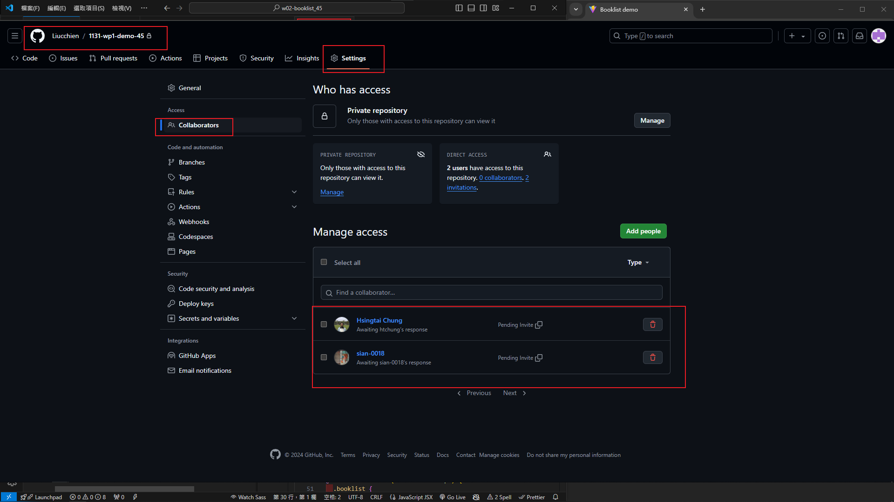
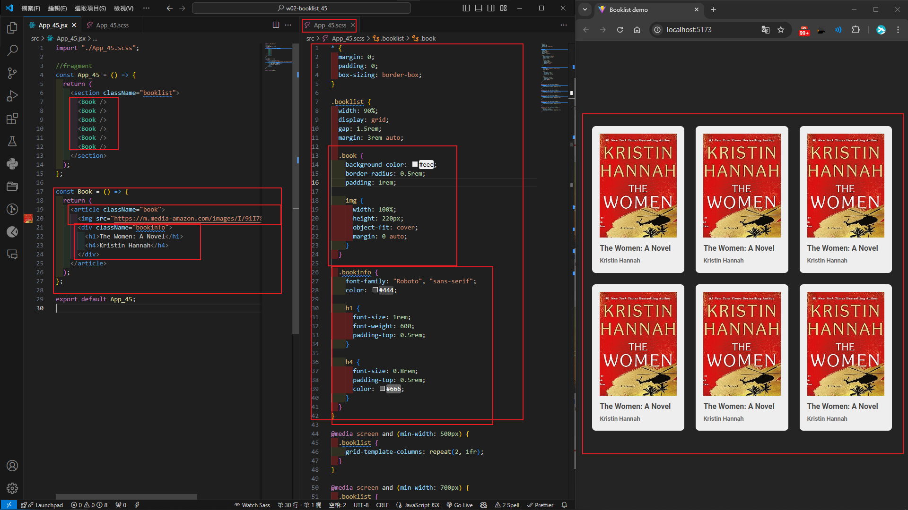
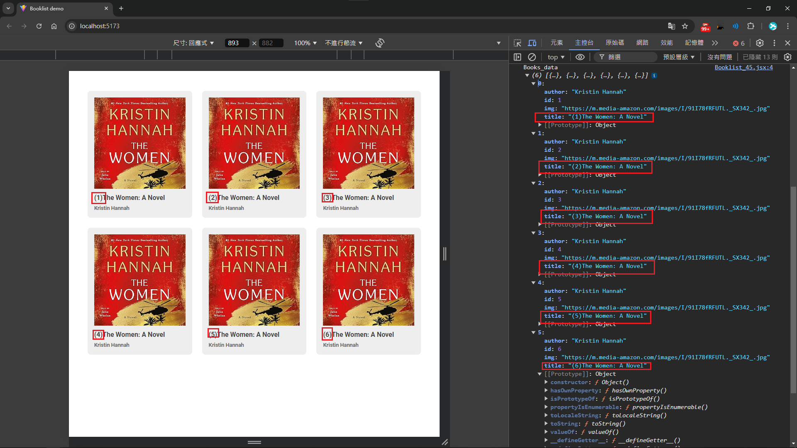
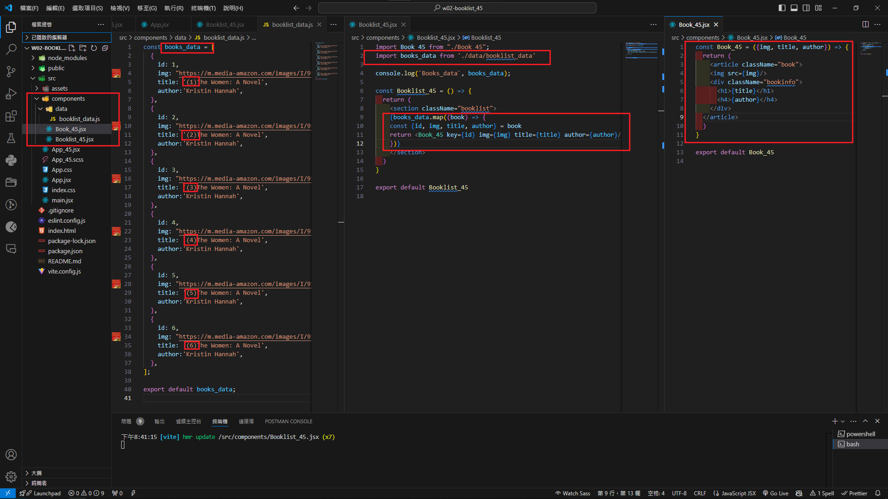
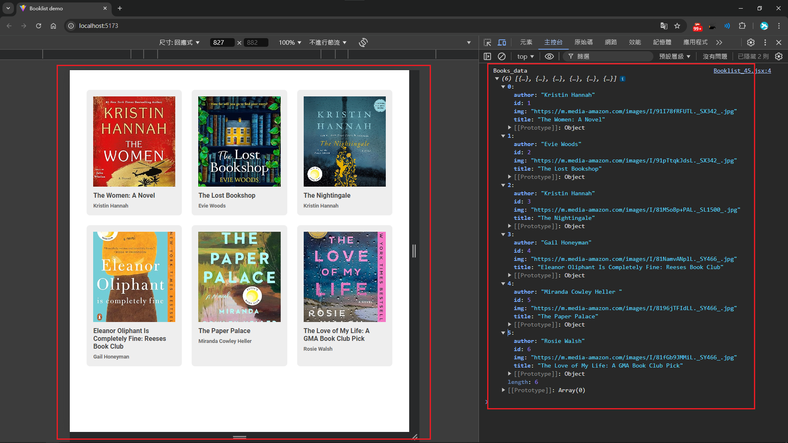
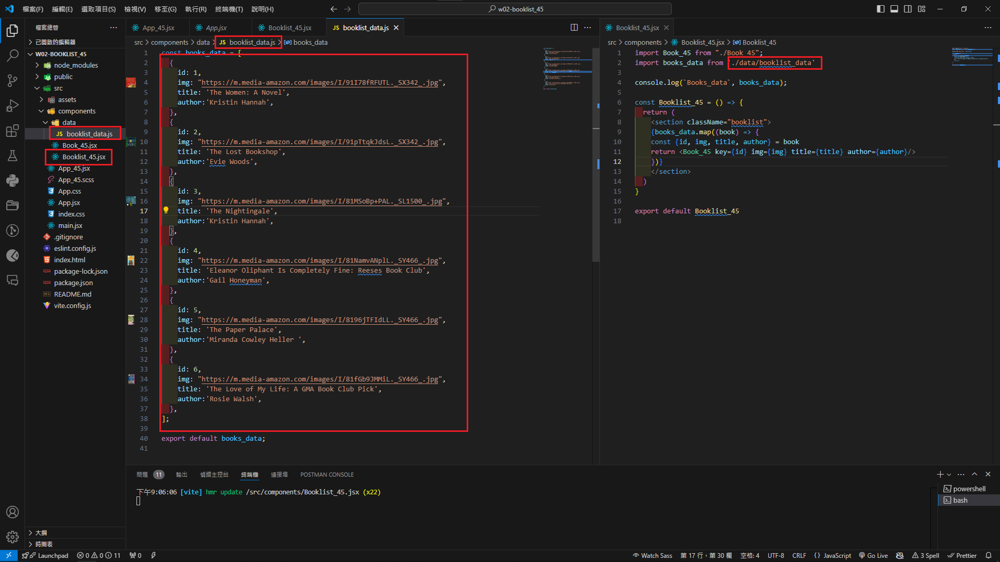

[Github URL](https://github.com/Liucchien/1131-wp1-demo-45)


### W02-P1: Github Share to teacher (htchung@gms.tku.edu.tw) and TA (sian-0018)
 


```

d55c98c Liucchien       Wed Sep 18 19:43:48 2024 +0800  W02-P1: Github Share to teacher (htchung@gms.tku.edu.tw) and TA (sian-0018)

```

### W02-P2: Show 6 <Book /> in React with responsive design
 



```

2efa23a Liucchien       Wed Sep 18 19:44:38 2024 +0800  W02-P2: Show 6 <Book /> in React with responsive design

```

### W02-P3: Create books_data (6 similar data) as json array and put it into <Booklist_xx />, then create 6 <Book_xx />
 



```

3ca874a Liucchien       Wed Sep 18 21:13:10 2024 +0800  ### W02-P3: Create books_data (6 similar data) as json array and put it into <Booklist_xx />, then create 6 <Book_xx />

```

### W02-P4: Get 6 different book data from Amazon, and show these 6 data correctly
 




git log --pretty=format:"%h%x09%an%x09%ad%x09%s" --after="2024-09-17"