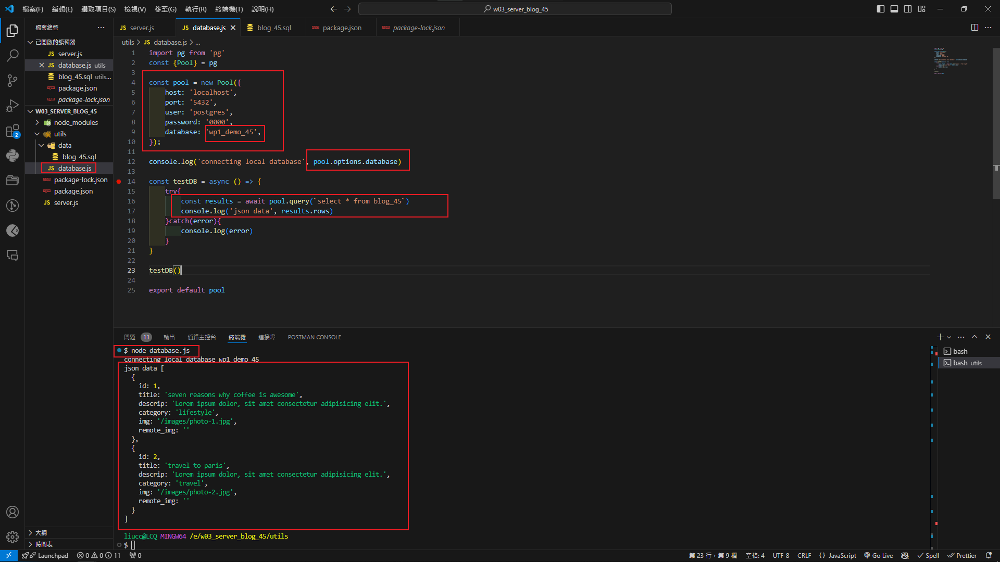
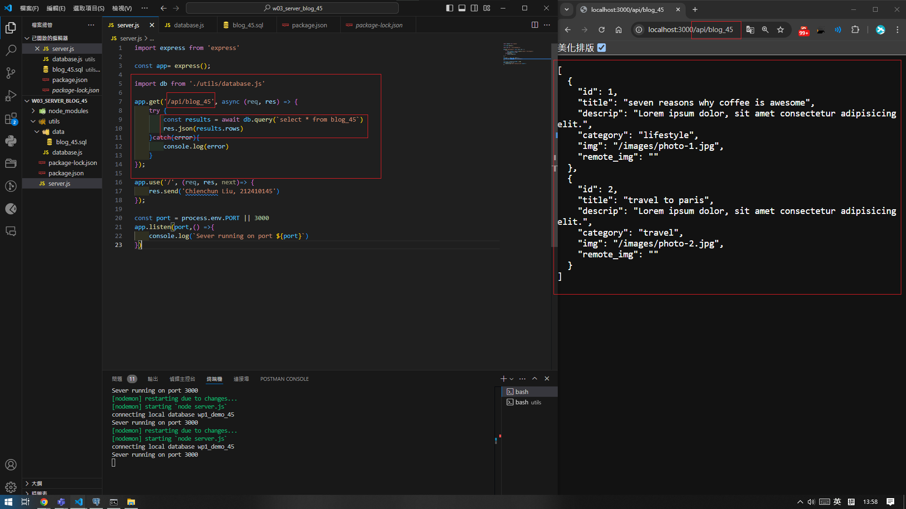
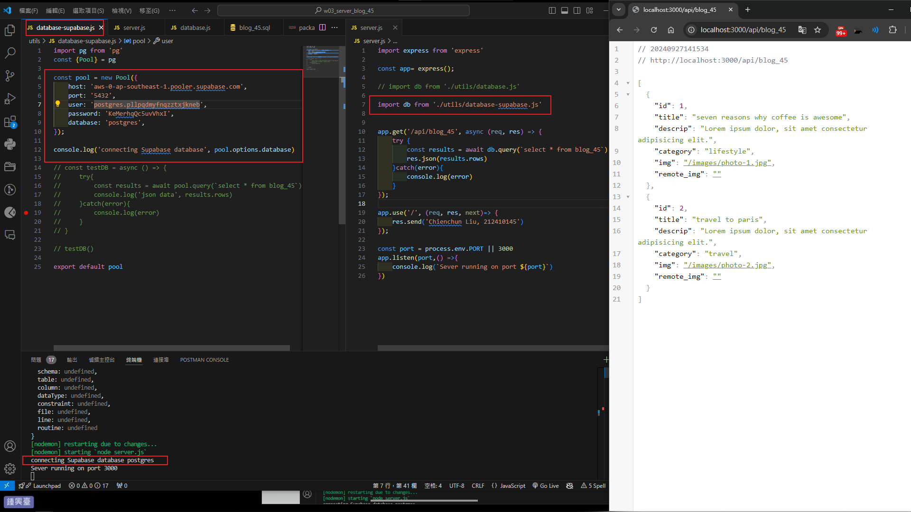

[Github URL](https://github.com/Liucchien/1131-wp1-demo-45)

### W03-P1: Create an express Web server and show your name and ID
 

 
```

0c32f8c Liucchien       Fri Sep 27 14:25:12 2024 +0800  W03-P1: Create an express Web server and show your name and ID

```

### W03-P2: Create wp1_demo_xx database with a table blog_xx, and put 2 data into blog_45
 
#### => pgAdmin
 

 
#### => sql
 

 
```

98e0e69 Liucchien       Fri Sep 27 14:26:30 2024 +0800  W03-P2: Create wp1_demo_xx database with a table blog_xx, and put 2 data into blog_45

```

### W03-P3: Create database.js to connect blog_45 as in P2 and show 2 data
 

 
```

7ffbba7 Liucchien       Fri Sep 27 14:26:58 2024 +0800  W03-P3: Create database.js to connect blog_45 as in P2 and show 2 data

```

### W03-P4: Using route /api/blog_xx to get json data and show it in the browser
 

 
```

546ac7c Liucchien       Fri Sep 27 14:29:11 2024 +0800  W03-P4: Using route /api/blog_xx to get json data and show it in the browser

```

### W03-P5: Using route /api/blog_xx to get json data from Supabase, and show it in the browser
 

 
```
4455eb5 htchung Wed Sep 25 20:50:17 2024 +0800  W03-P5: Using route /api/blog_xx to get json data from Supabase, and show it in the browser
```


git log --pretty=format:"%h%x09%an%x09%ad%x09%s" --after="2024-09-24"