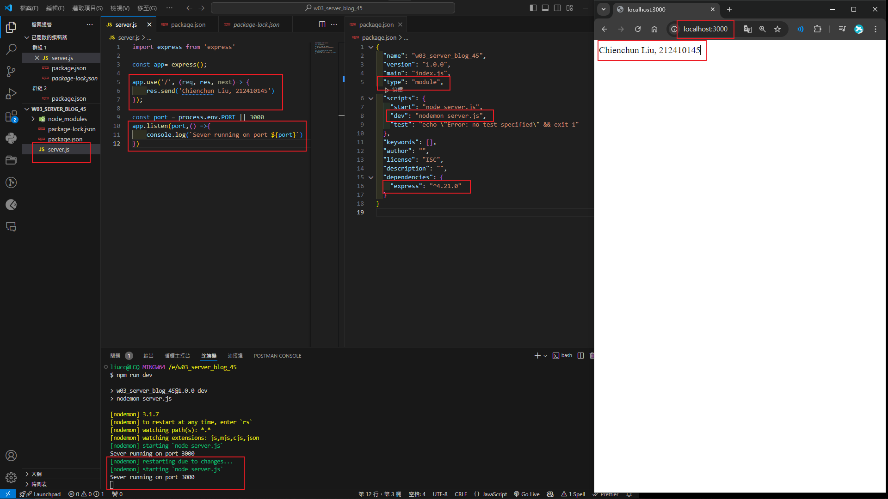
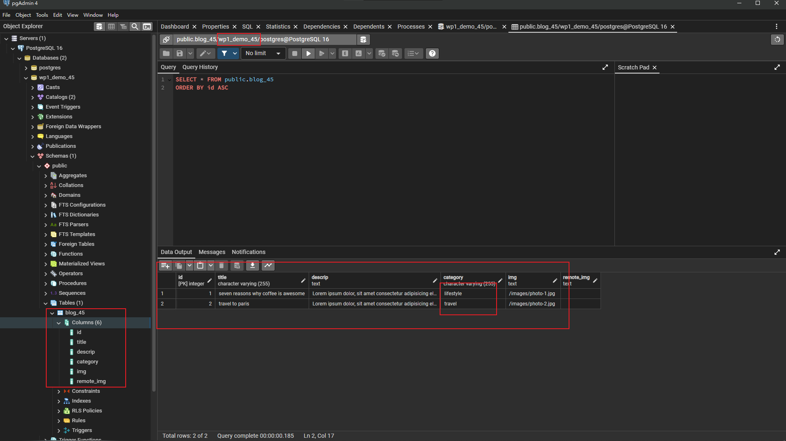
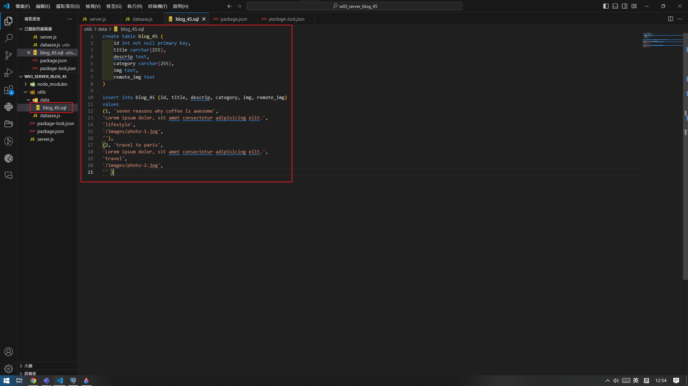

[Github URL](https://github.com/Liucchien/1131-wp1-demo-45)

### W03-P1: Create an express Web server and show your name and ID
 

 
```

0c32f8c Liucchien       Fri Sep 27 14:25:12 2024 +0800  W03-P1: Create an express Web server and show your name and ID

```

### W03-P2: Create wp1_demo_xx database with a table blog_xx, and put 2 data into blog_45
 
#### => pgAdmin
 

 
#### => sql
 

 
```


```


git log --pretty=format:"%h%x09%an%x09%ad%x09%s" --after="2024-09-24"