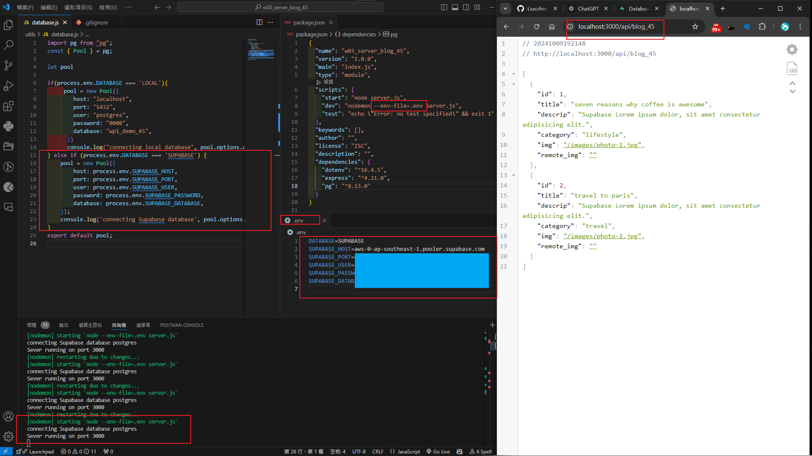
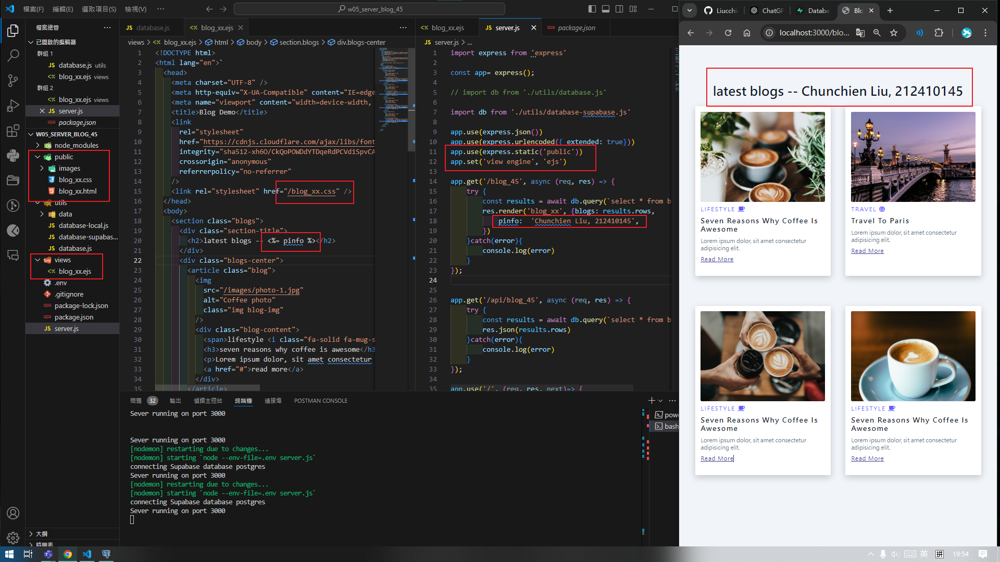
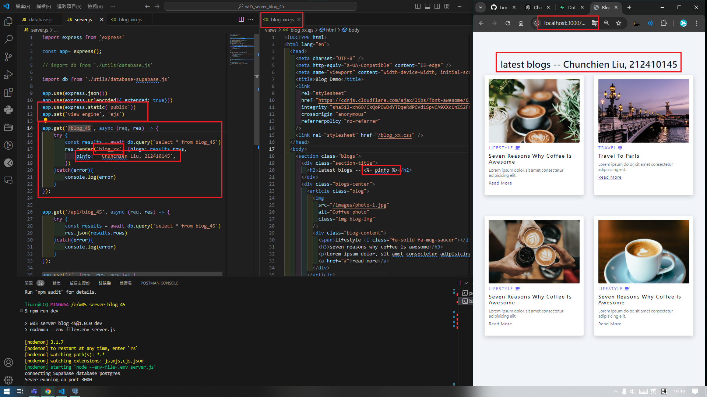

[Github URL](https://github.com/Liucchien/1131-wp1-demo-45)

### W05-P1: Use .env to connect Supabase, and show blogs via route /api/blog_xx
 

 
```

0da28be Liucchien       Wed Oct 9 21:50:33 2024 +0800   W05-P1: Use .env to connect Supabase, and show blogs via route /api/blog_xx


```

### W05-P2: Use blog theme to create blog_xx.ejs and show your info from pinfo variable
 

 

 
```


```


git log --pretty=format:"%h%x09%an%x09%ad%x09%s" --after="2024-10-08"