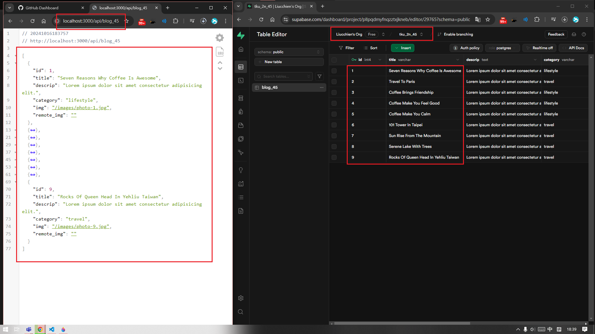
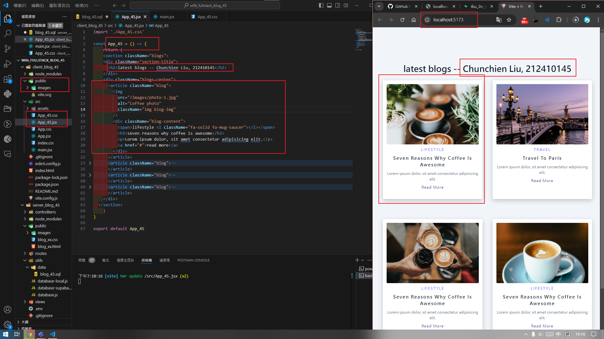
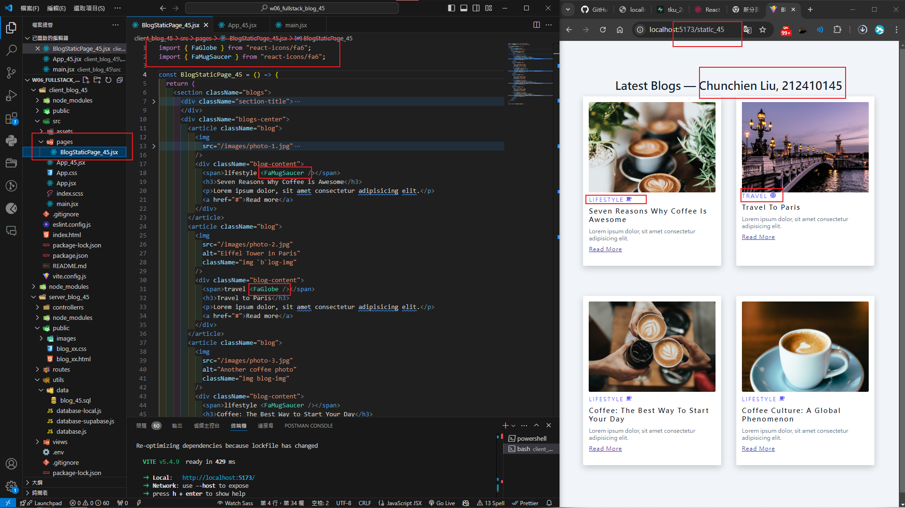

[Github URL](https://github.com/Liucchien/1131-wp1-demo-45)

### W06-P1: Insert 9 blogs into Supabase, and retrieve through route localhost:3000/api/blog_45
 


 
```

628a91d Liucchien       Wed Oct 16 21:22:53 2024 +0800  W06-P1: Insert 9 blogs into Supabase, and retrieve through route localhost:3000/api/blog_45

```


### W06-P2: Create a vite, and show 4 static blogs from blog.html
 

 
```

af8689c Liucchien       Wed Oct 16 21:23:33 2024 +0800  W06-P2: Create a vite, and show 4 static blogs from blog.html

```
 
### W06-P3: Create BlogStaticPage_xx component to show 4 static photos with corresponding react-icons
 

 
```


```


git log --pretty=format:"%h%x09%an%x09%ad%x09%s" --after="2024-10-15"